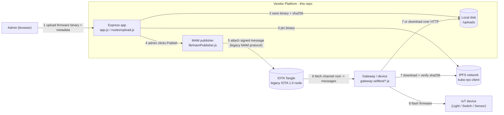

# IOTA MAM Firmware Deployment

A small research prototype (Tokyo Institute of Technology, 2019-2023) built to
explore a **security-enhanced firmware management scheme for smart-home IoT
devices using distributed ledger technology**. It is a vendor-side web
platform that lets an administrator upload a firmware binary and publish a
signed, tamper-evident "new firmware is available" announcement onto the
IOTA Tangle, which IoT gateways/devices can independently verify and act on
without trusting the vendor's web server at delivery time.

## What it actually does

1. An admin logs in (Facebook OAuth, via Passport) and uploads a firmware
   binary through the web UI (`routes/upload.js`).
2. The binary is stored locally and pinned to IPFS; its SHA-256 hash and IPFS
   CID are computed.
3. The admin reviews the metadata and clicks **Publish** (`app.js`, `/send`
   route), which packages `{ firmware_version, file_name, file_size,
   file_hash, file_url, device_type }` and publishes it as the next message
   on a **MAM (Masked Authenticated Messaging)** channel derived from a
   vendor seed (`lib/mamPublisher.js`).
4. Any device or gateway that knows the channel's public root can fetch and
   decode every message ever published to it, in order, and verify it came
   from the same channel owner — without needing a centralized "update
   server" to be trusted at read time. The actual firmware bytes are fetched
   separately over HTTP/IPFS and checked against `file_hash`.
5. `gateway-selftest/fetch-MAM.js` and `gateway-selftest/gw-test.js` are
   standalone scripts simulating the device/gateway side: they subscribe to
   a MAM root and replay the announcements.

## Architecture



Key point: the Tangle/MAM channel only ever carries the *announcement*
(version, hash, where to fetch it) — never the firmware binary itself. A
device trusts the announcement because only the vendor's seed can extend
that MAM channel, and it trusts the binary because it independently
recomputes the SHA-256 hash before flashing.

## Legacy protocol notice — read before deploying

This project was built against the **original IOTA MAM protocol and the
pre-Chrysalis IOTA 1.0 mainnet** (`iota.lib.js`, `lib/mam.node.js`, PoW-based
attachment to a Tangle node). Since then:

- IOTA Chrysalis (2021) removed the trinary/PoW model this client speaks; the
  legacy MAM protocol and `iota.lib.js`/`@iota/mam` client libraries are
  **unmaintained and archived** by the IOTA Foundation.
- The IOTA Foundation's intended MAM successor, **Streams**, is a Rust
  library exposed to JS via a WASM binding (`streams` / former
  `iota-streams-wasm`) with a fundamentally different transport and message
  format. It is **not a drop-in replacement** — there is no way to swap the
  import and keep this code working, and Streams itself has seen little
  activity since IOTA's roadmap moved on to Shimmer/EVM-compatible L2s and
  now the "IOTA Rebased" ledger, none of which speak MAM or Streams natively.
  There is currently no actively maintained, source-compatible successor
  library in the JS ecosystem.
- The public node this project targeted
  (`https://tangle.anushkawijesundara.com:8443`) was a personal research node
  and is not expected to be reachable.

**Given that, this repo deliberately keeps the original MAM publish/fetch
logic intact** (now consolidated in `lib/mamPublisher.js`) rather than
half-porting it to an incompatible library, so the research artifact stays
reproducible against a compatible legacy IOTA node. If you need this pattern
in a real deployment today, treat this as reference material for the
*design* (tamper-evident append-only announcement channel, hash-verified
out-of-band payload delivery) and re-implement the transport on top of
Streams, or on any ledger/log with equivalent append-only + authenticated
properties (e.g. a signed transparency log).

## Stack

- Node.js + Express 4, EJS templates (`express-ejs-layouts` replaces the
  unmaintained `ejs-locals`)
- Passport (Facebook OAuth) for the admin login
- Multer for firmware upload handling
- `kubo-rpc-client` for pinning binaries to IPFS (replaces the deprecated
  `ipfs-api` package)
- `iota.lib.js` + `lib/mam.node.js` (vendored, prebuilt legacy MAM client) for
  publishing to the Tangle — see notice above
- `dotenv` for local configuration

## Setup

Requires Node.js (LTS) and npm. A reachable legacy-IOTA-1.0 node and an IPFS
(Kubo) node are needed for the Tangle/IPFS features to actually do anything;
the web UI and upload flow work without them.

```bash
npm install
cp .env.example .env   # fill in IOTA_NODE_PROVIDER, IOTA_MAM_SEED, IPFS_*, etc.
npm start              # http://localhost:3000
```

Configuration (all optional; unset values fall back to the original
placeholders) is read from environment variables — see `.env.example` for
the full list: IOTA node/seed/root, IPFS host/port, upload directory and
public base URL, and Facebook OAuth credentials (also settable in
`config.js`).

To exercise the device/gateway side of the flow once a channel root exists:

```bash
node gateway-selftest/fetch-MAM.js   # one-shot fetch + log
node gateway-selftest/gw-test.js     # same, plus a bare HTTP listener on :8080
```

## What was verified

Node.js/npm were not available in the environment used to modernize this
repo, so `npm install` and `npm start` could **not** be executed here. The
changes were limited to:

- dependency manifest updates to current stable versions of actively
  maintained packages (see `package.json`),
- replacing the deprecated `ipfs-api` client with `kubo-rpc-client` and
  updating `routes/upload.js` to its promise-based API,
- replacing `body-parser`/`ejs-locals` with the Express/EJS built-in and
  maintained equivalents,
- fixing a pre-existing broken relative import in both
  `gateway-selftest/*.js` scripts (`./lib/mam.node.js` inside a subdirectory
  that has no `lib/`, corrected to `../lib/mam.node.js`),
- consolidating the duplicated inline MAM publish/fetch logic from `app.js`
  into `lib/mamPublisher.js` without changing what is sent to the Tangle,
- removing unused dependencies (`@iota/core`, `@iota/converter`,
  `@iota/curl`, `mongodb`, `crypto-js`, `buffer-shims`) that were listed in
  `package.json` but never required anywhere in the code, and two stale
  backup copies of `routes/upload.js`.
- deleting the old `package-lock.json`, which pinned the previous (now
  superseded) dependency tree — run `npm install` to regenerate it against
  the updated `package.json`.

Anyone picking this back up should run `npm install` and `npm start` (or
`npm run build`/lint if added) locally to confirm the updated dependency
tree resolves before relying on it further, since that step could not be
performed in this environment.

## Version history

- v1.0 — MAM enabled
- v1.1 — IPFS enabled
- v1.2 — dependency and API modernization; legacy-protocol documentation
  (this change)

## Author

Anushka Wijesundara — Tokyo Institute of Technology (student no. 18M18780)
